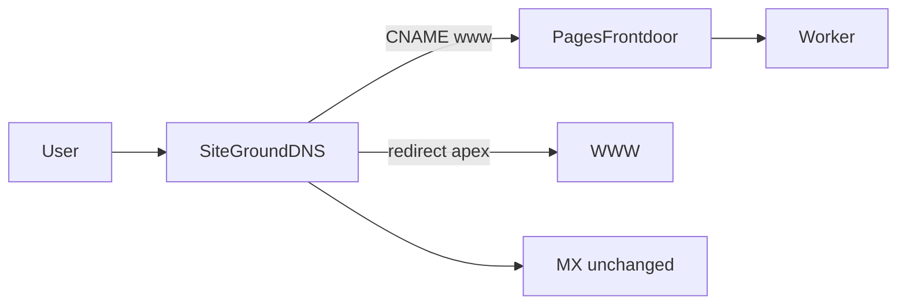

# Cloudflare deployment

**Account:** Nucalv.it@gmail.com (`ded6f41ae76367e770374f96348202dc`)

| URL | Purpose |
|-----|---------|
| **https://nucawebsite.nucalv-it.workers.dev** | Worker (direct) |
| **https://master.nuca-frontdoor.pages.dev** | Pages front-door (interim) |
| **https://www.nucalasvegas.com** | Production (after SiteGround DNS below) |

## Resources

| Resource | Name | Binding |
|----------|------|---------|
| Worker | `nucawebsite` | — |
| Pages front-door | `nuca-frontdoor` | Service binding → `nucawebsite` |
| D1 | `nuca-lv` | `DB` |
| R2 | `nuca-lv-assets` | `R2` |
| Email | Cloudflare Email Service | `EMAIL` |
| Static assets | `public/` | `ASSETS` |

## Deploy

```bash
# Main app (Worker + D1 + R2)
npm run deploy

# Pages front-door (proxies www → Worker; only needed when frontdoor/ changes)
npm run deploy:frontdoor
```

---

## Interim domain cutover (SiteGround DNS — no GoDaddy nameserver change)

The Worker cannot use a custom domain until nameservers point to Cloudflare. Until GoDaddy login is available, **`nuca-frontdoor`** (Cloudflare Pages) accepts a **www CNAME** from SiteGround and proxies all traffic to the `nucawebsite` Worker via a service binding.



### Step 1 — SiteGround DNS (web only)

**Do not change MX, SPF, or DKIM records** — SiteGround email keeps working.

| Record | Type | Name | Value | Notes |
|--------|------|------|-------|-------|
| www | **CNAME** | `www` | `nuca-frontdoor.pages.dev` | Remove old www A/CNAME to WordPress first |
| apex | **Redirect** | `@` | `https://www.nucalasvegas.com` | SiteGround domain redirect tool (301). Remove old @ A record to WordPress. |

After saving, wait a few minutes, then check custom domain status:

```bash
node scripts/add-pages-domain.mjs
```

`www.nucalasvegas.com` should show status **active** once the CNAME propagates.

### Step 2 — Verify

| Check | URL |
|-------|-----|
| Homepage | https://www.nucalasvegas.com |
| Apex redirect | https://nucalasvegas.com → www |
| Admin login | https://www.nucalasvegas.com/admin/login |
| R2 assets | Member logos, event flyers, PDFs |
| Contact form | Submit a test message |
| SiteGround inbox | Send to `info@nucalasvegas.com` |

**Note:** Admin and sessions work on **www** only during the interim phase. Bare apex redirects to www.

---

## Phase 2 — Full cutover (when GoDaddy login is available)

1. Add `nucalasvegas.com` as a **Cloudflare zone** on the Nucalv.it account.
2. Copy MX / SPF / DKIM from SiteGround into Cloudflare DNS (grey-cloud MX records).
3. Add Worker custom domains in `wrangler.jsonc`:

```jsonc
"routes": [
  { "pattern": "nucalasvegas.com", "custom_domain": true },
  { "pattern": "www.nucalasvegas.com", "custom_domain": true }
]
```

4. `npm run deploy`
5. Change **nameservers at GoDaddy** to Cloudflare's.
6. Remove Pages custom domain and SiteGround www CNAME; optional: delete `nuca-frontdoor` project.

---

## Admin access

All staff portal users are **admins** with full access. (Legacy chair/member roles were removed in migration `0019_admins_only.sql`.)

1. Set Worker secrets (see below).
2. On first visit to `/admin`, the Worker creates the first admin from `ADMIN_EMAIL` + `ADMIN_PASSWORD` when the database has no users.
3. Sign in at **/admin/login**.

Default email (Wrangler var): `info@nucalasvegas.com` — change in `wrangler.jsonc` `vars.ADMIN_EMAIL` if needed.

## Security features

| Feature | Implementation |
|---------|----------------|
| Session cookies | HttpOnly JWT, `Secure` on HTTPS, `SameSite=Lax`, 24-hour TTL |
| CSRF | Token in JWT; `admin-security.js` adds to forms and `fetch` POSTs |
| Login rate limit | 5 failed attempts / IP / 15 min (D1 `login_attempts` table) |
| Session invalidation | `users.session_version` checked on each request |
| Audit log | D1 `admin_audit_log` — login, logout, user create, settings, newsletter export |
| Response headers | `X-Content-Type-Options`, `Referrer-Policy`, `X-Frame-Options`, `Permissions-Policy` |

Apply migration `0021_security.sql` before deploying security updates.

### Login rate limiting: code vs Cloudflare dashboard

**In-code (implemented):** Uses D1, versioned with your app, works on any plan. Slight Worker/DB cost per login attempt.

**Cloudflare dashboard rule (optional extra layer):** Blocks brute-force at the edge before your Worker runs. Recommended on paid plans if login abuse is a concern. Configure a rate limiting rule for `POST /admin/login` (e.g. 10 requests / minute / IP).

Use both for defense in depth, or code-only if you prefer everything in the repo.

### Turnstile (optional bot protection)

Turnstile is **wired but off** until you add keys.

1. In [Cloudflare Turnstile](https://dash.cloudflare.com/?to=/:account/turnstile), create a widget for your site hostname.
2. Set the **site key** (public) as a Worker var and the **secret key** as a Worker secret:

```bash
# wrangler.jsonc vars (or dashboard → Settings → Variables)
"TURNSTILE_SITE_KEY": "0x..."

npx wrangler secret put TURNSTILE_SECRET_KEY
```

3. Redeploy. The login form shows the Turnstile widget automatically when `TURNSTILE_SITE_KEY` is set.
4. The Worker verifies `cf-turnstile-response` on POST `/admin/login` when `TURNSTILE_SECRET_KEY` is set.

If neither Turnstile key is set, login works as before (rate limiting still applies).

## Secrets (Worker)

| Secret / var | Purpose |
|--------------|---------|
| `JWT_SECRET` | Signs admin session JWT cookies (use 32+ random characters) |
| `ADMIN_PASSWORD` | Password for the pre-seeded admin |
| `TURNSTILE_SITE_KEY` | Optional Turnstile widget (public var) |
| `TURNSTILE_SECRET_KEY` | Optional Turnstile verification (secret) |

```bash
npx wrangler secret put JWT_SECRET
npx wrangler secret put ADMIN_PASSWORD
# optional:
npx wrangler secret put TURNSTILE_SECRET_KEY
```

Local copies live in **`.dev.vars`** (not committed).

## Local development

```bash
cp .dev.vars.example .dev.vars
npm run dev
```

## Migrations

```bash
npm run migrate
npm run migrate:local
```
